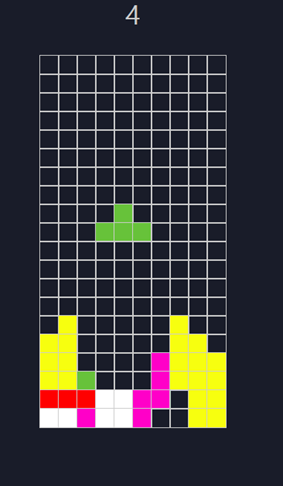

<span>
<h2> 테트리스 게임

 </h2>
</span>

 <span>


</span>


<h2>index.html body 내용</h2> 

```ruby
    <div class="wrapper">
        <div class="game-text">
            <span>게임종료</span>
            <button> 다시시작</button>
        </div>
        <div class="score">내 점수 : 0</div>
        <div class="playground">
            <ul></ul>
        </div>
    </div>
```

<h2>js와 css 를 불러왔습니다</h2>

```ruby
<link rel="stylesheet" href="css/style.css">
<script src="js/tetris.js" type="module"></script>
```

<h2>tetris.js</h2>

```ruby
function prependNewLine() {
    const li = document.createElement("li");
    const ul = document.createElement("ul");
    for (let j = 0; j < GAME_COLS; j++) {
        const matrix = document.createElement("li");
        ul.prepend(matrix);
    }
    li.prepend(ul)
    playground.prepend(li)
}
```
<h3>매트릭스를 생성하는 js</h3>


```ruby
function renderBlocks(moveType=" "){
    const {type, direction,top,left} =tempMovingItem;
    const movingBlocks = document.querySelectorAll(".moving");
    movingBlocks.forEach(moving=>{
        moving.classList.remove(type, "moving"); 
    })

    BLOCKS[type][direction].some(block => {
        const x = block[0] + left;
        const y = block[1] + top; 
        const target = playground.childNodes[y]?playground.childNodes[y].childNodes[0].childNodes[x] : null ;
        const isAvailable = checkEmpty(target);
        if(isAvailable){
            target.classList.add(type,"moving")
        }else{
            tempMovingItem={...movingItem}
            if(moveType =='retry'){
                clearInterval(downInterval)
                showGameoverText()
            }
            setTimeout(() =>{
                renderBlocks('retry');
                if(moveType ==="top"){
                    seizeBlock();
                }
               
            },0)
            return true;
        }
        
    });
    movingItem.left=left;
    movingItem.top=top;
    movingItem.direction=direction;
}
}
```
<h3>매트릭스의 설정</h3>

```ruby
function seizeBlock(){
    const movingBlocks = document.querySelectorAll(".moving");
    movingBlocks.forEach(moving=>{
        moving.classList.remove("moving"); 
        moving.classList.add("seized"); 
    })
    checkMatch()
}
```
<h3>바닥에 블럭이 닿였을 때 멈추게 하기 위한 선언</h3>

```ruby
function checkMatch(){
    const childNodes = playground.childNodes;
    childNodes.forEach(child=>{
        let matched=true;
        child.children[0].childNodes.forEach(li=>{
            if(!li.classList.contains("seized")){
                matched=false;
            }
        })
        if(matched){
            child.remove();
            prependNewLine()
            score++;
            scoreDisplay.innerText = score;
        }
    })
    generateNewBlocks()
}
```
<h3>일자로 만들어 졌을 떄 상황</h3>
